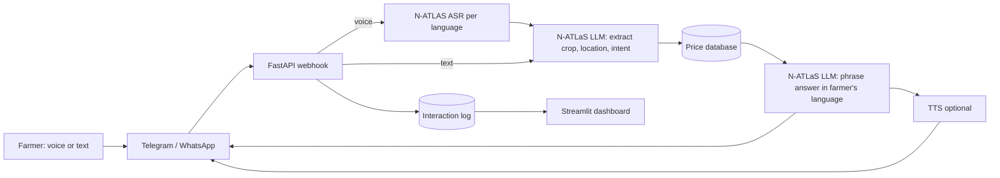

# Architecture

Two-call pattern: the LLM (1) turns a free-form question into a small JSON form, then (2) phrases an answer from
database rows it is given. This is more reliable on an 8B model than open-ended tool calling, and guarantees every
price shown comes from the database.
